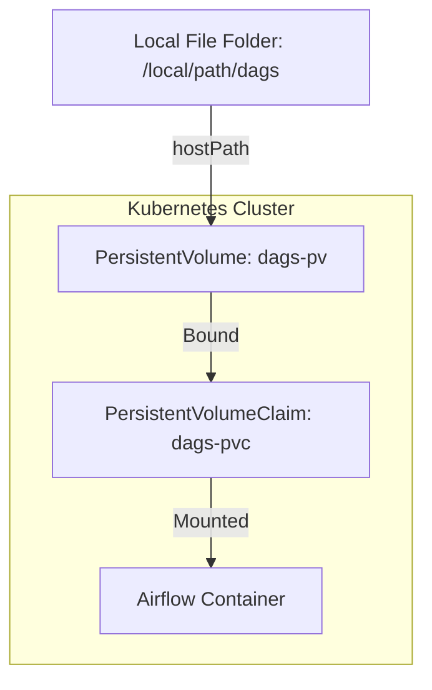

# Local Setup in WSL

- [x] kind
- [x] kubectl
- [x] helm
- [ ] Charts
  - [ ] airflow
  - [ ] postgres
  - [ ] minio

> <h3>How to start?</h3>
> 
> ```bash
> $ ./run.sh 
>   Usage: ./run.sh <start|stop|status>
> ```
> |Command|Desc|
> |---|---|
> |`./run.sh start`|Strat cluster with airflow|
> |`./run.sh stop`| stop the cluster|
> |`./run.sh status`| Get cluster status|

### Commands
<details>
  <summary>Airflow Containers</summary>

  - Add airflow charts:
    ```bash
    helm repo add apache-airflow https://airflow.apache.org
    helm repo update
    ```
  - Download charts locally:
    ```bash
    helm pull apache-airflow/airflow --untar --destination ./chart
    ```
  - Port forward airflow-webserver container. check and update container name. 
    ```bash
    kubectl port-forward airflow-webserver-7d55647b5d-lvhzl 8090:8080 -n airflow
    ```
</details>


### Ideas 

<details>
  <summary>How mounted airflow dag folder ?</summary>


Ref: https://airflow.apache.org/docs/helm-chart/stable/manage-dags-files.html#mounting-dags-from-an-externally-populated-pvc

</details>

